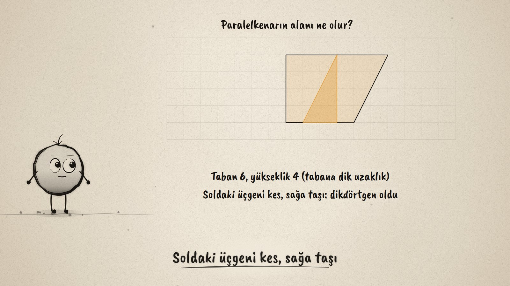
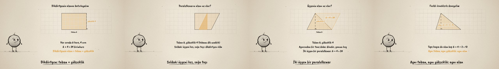

# Kes ve Taşı · Areas of Parallelograms and Triangles

**▶ Tarayıcıda izleyin / Watch in the browser:** https://hakanatas.github.io/kes-ve-tasi/ 
**⬇ MP4 + altyazılar / MP4 + subtitles:** [Releases](https://github.com/hakanatas/kes-ve-tasi/releases) 
**✎ Kullanılan istem / The prompt behind it:** [PROMPT.md](PROMPT.md) 
**🎞 Bütün filmler / All films:** [Nokta'nın Filmleri](https://hakanatas.github.io/nokta-filmleri/?sinif=6)

> **TR —** 6. sınıf matematik "Geometrik Nicelikler" temasındaki MAT.6.4.2 öğrenme çıktısı için hazırlanmış, tamamen JavaScript ile çizilen 92 saniyelik mürekkep animasyonu. Kareli zeminde 6'ya 4'lük bir dikdörtgen: birim kareler sıra sıra sayılıyor, 6 × 4 = 24, yani alan = taban × yükseklik. Üst kenar kaydırılınca paralelkenar oluyor; tabanı 6, yüksekliği (tabana dik uzaklık) 4. Soldaki üçgen kesilip sağa taşınınca aynı dikdörtgen çıkıyor: paralelkenarın alanı da taban × yükseklik. Tabanı 6, yüksekliği 4 olan bir üçgenin bir eşi döndürülüp yanına konunca bir paralelkenar oluşuyor; üçgen onun yarısı: 24 ÷ 2 = 12. Çıkarım farklı örneklerle sınanıyor: paralelkenarın üst kenarı kaydıkça alan hep 24, üçgenin tepesi paralel bir doğru boyunca kaydıkça (dışarı taşsa bile) alan hep 12. Altyazılar Türkçe, İngilizce ya da ikisi birlikte seçilebilir.

A 92-second ink animation for **6th-grade maths**, the second film of the fourth 6th-grade theme. Nokta, the ink character from [The Learning Ink](https://github.com/hakanatas/the-learning-ink), is the guide again. All shapes live on the same unit grid (`U` in `src/draw/film.js`), so every cut, slide and turn lands on whole squares and the areas can be checked by counting.

## Learning outcome

MEB, Türkiye Yüzyılı Maarif Modeli, Ortaokul Matematik, 6th grade, "Geometrik Nicelikler" theme:

**MAT.6.4.2. Dikdörtgenin alan bağıntısına yönelik deneyimlerini paralelkenar ve üçgenin alan bağıntılarına yansıtabilme**
- a) Dikdörtgenin alan bağıntısını gözden geçirir.
- b) Dikdörtgenin alan bağıntısından yola çıkarak paralelkenar ve üçgenin alan bağıntıları hakkında çıkarım yapar.
- c) Çıkarımını farklı örnekler üzerinden değerlendirir.

## Scenes

| # | Time | Scene | What happens | Outcome |
|---|---|---|---|---|
| 1 | 0–10 s | Dikdörtgen | A 6 × 4 rectangle on a unit grid. | a |
| 2 | 10–28 s | Dikdörtgenin alanı | Counting row by row: 6 × 4 = 24; area = base × height. | a |
| 3 | 28–46 s | Paralelkenar | Slide the top; cut off the left triangle and move it right: the same 6 × 4 rectangle. | b |
| 4 | 46–64 s | Üçgen | A turned copy makes a parallelogram of 24; the triangle is half: 12. | b |
| 5 | 64–80 s | Farklı örnekler | The top side slides, the area stays 24; the apex slides, the area stays 12. | c |
| 6 | 80–92 s | Aklında kalsın | Base × height, and half of it for a triangle. | b, c |

## Running it

- **Preview:** double-click `index.html` (it works offline).
- **MP4:** run `npm install` once, then `npm run export -- --format=horizontal --captions=tr`.
- **Subtitles and narration:** `npm run srt` writes `out/captions_*.srt` and `narration_notes.txt`.
- **Editing:**
  - Caption text, timings and narration notes: `captions.js`
  - Everything on screen is drawn by `LI.world(t)` in `scenes/scene1.js` (the rectangle, the cut, the turned triangle, the sliding shapes, the words); the other scenes only set the camera.
  - The grid, polygons, dashed heights and Nokta's poses: `src/draw/film.js`; layout for 16:9 and 9:16: `src/draw/kd.js`

It uses the same engine as The Learning Ink: `renderFrame(t)` as a pure function of time, seeded randomness, and frame-by-frame export.

## Lisans · License

**TR —** Bu film ve kodu [Creative Commons Atıf-GayriTicari 4.0 Uluslararası (CC BY-NC 4.0)](https://creativecommons.org/licenses/by-nc/4.0/deed.tr) lisansıyla paylaşılır. Ticari olmayan her amaçla (derste, okulda, eğitim materyalinde) kopyalayabilir, paylaşabilir ve değiştirebilirsiniz; ancak **kaynak göstermek zorunludur**: eser sahibinin adı ve bu deponun bağlantısı belirtilmeden kullanılamaz. Ticari kullanım (satış, ücretli ürün ya da yayın) için izin alınmalıdır.

**EN —** This film and its code are licensed under [Creative Commons Attribution-NonCommercial 4.0 International (CC BY-NC 4.0)](https://creativecommons.org/licenses/by-nc/4.0/). You may copy, share and adapt them for non-commercial purposes, but **attribution is required**: they may not be used without crediting the author and linking to this repository. Commercial use requires permission.

Atıf örneği / Required credit: *“Kes ve Taşı”, Hakan Ataş, Nokta'nın Filmleri — https://github.com/hakanatas/kes-ve-tasi — CC BY-NC 4.0*
